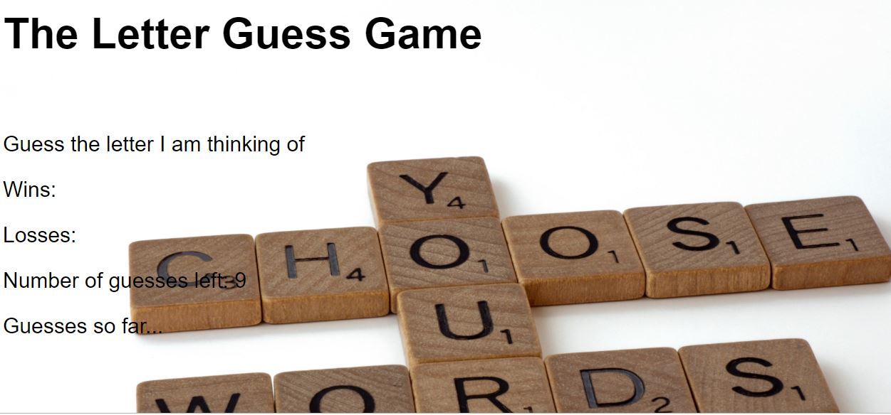

# Letter Guess Game

## Description
The focus of this unit is JavaScript and the fundamental programming concepts necessary to solve a computational problem. Practice writing for loops, conditional statements such as if/else and switch statements, further reinforce fundamental concepts that can be applied to any programming language.

